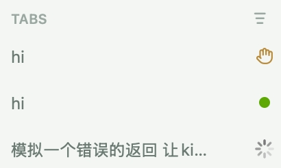

# kimi-otty

[English Documentation](./README.md)

Otty 终端集成插件 — 在 Otty 终端面板中为 Kimi Code CLI 会话展示处理中 / 空闲 / 等待输入的实时状态徽章。



## 功能

- **实时状态徽章**：在 Otty 终端面板标题栏显示 Kimi 当前状态（处理中 / 空闲 / 等待输入）。
- **多实例支持**：通过进程 PID 匹配，同一工作目录下多个 Kimi 实例可各自独立显示状态。
- **子智能体感知**：当后台子智能体仍在运行时，不会误报为空闲状态。
- **交互式工具感知**：当 `AskUserQuestion` 或 `ExitPlanMode` 触发时自动切换为"等待输入"状态。

## 安装

如何安装第三方插件请通过 kimi code 文档进行了解：https://www.kimi.com/code/docs/kimi-code-cli/customization/plugins.html#%E4%BB%8E-github-%E5%AE%89%E8%A3%85 

```http
https://github.com/youngxhui/kimi-otty/releases/tag/v0.1
```


## 工作原理

插件通过 Kimi Code CLI 的 Hook 机制监听以下事件：

| Hook 事件            | 上报状态     |
| -------------------- | ------------ |
| `SessionStart`       | idle         |
| `PreToolUse`         | processing   |
| `PostToolUse`        | processing   |
| `PermissionRequest`  | awaiting     |
| `UserPromptSubmit`   | processing   |
| `Stop`               | idle         |

`otty-hook.sh` 脚本通过 IPC 将状态和会话元数据发送给 Otty 应用，Otty 根据这些信息在对应终端面板显示状态徽章。

### 智能状态判定

脚本内置了以下特殊处理逻辑：

- **子智能体保活**：当 hook 收到 Stop 事件但检测到仍有后台子智能体（subagent）运行时，状态会保持为 processing，确保徽章不会提前切换。
- **等待用户输入识别**：当检测到 `AskUserQuestion` 或 `ExitPlanMode` 工具调用时，状态从 processing 修正为 awaiting。

## 文件结构

```
kimi-plugins/
├── kimi.plugin.json  # 插件元数据与 Hook 定义
└── otty-hook.sh       # 状态上报脚本
```

## 要求

- [Kimi Code CLI](https://github.com/MoonshotAI/kimi-code)
- [Otty](https://otty.sh/)（macOS）

## 许可

MIT
